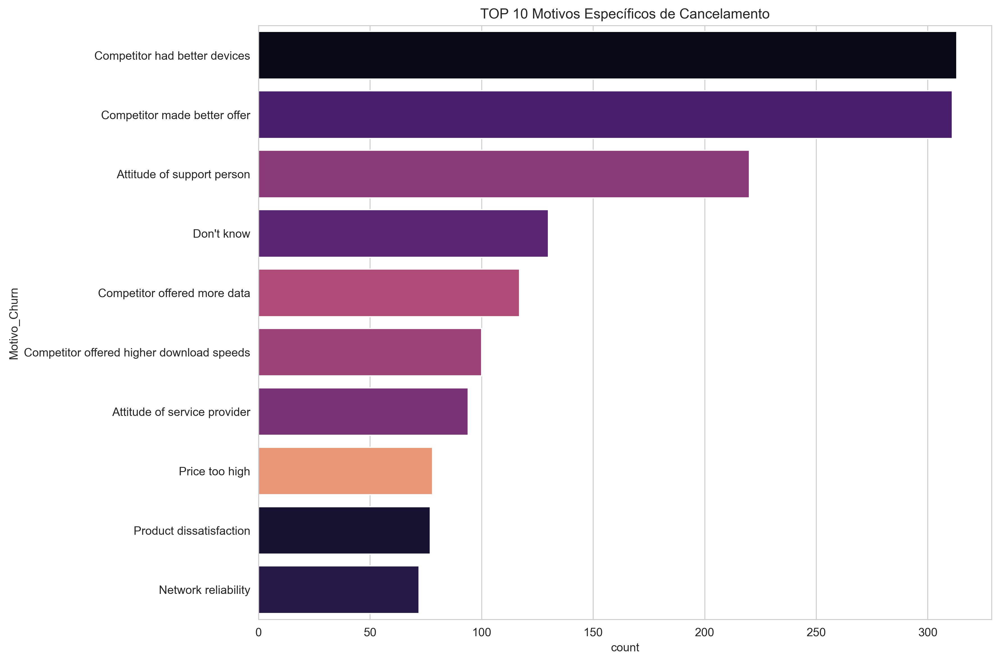

# 📊 Análise de Cancelamento de Clientes (Churn)

Projeto de análise de cancelamento de clientes com foco em retenção e impacto financeiro.
---

## 🎯 Contexto do Problema

Empresas de telecom lidam com cancelamentos mensais que impactam diretamente a receita recorrente e a previsibilidade do negócio.

O objetivo deste projeto é analisar os principais fatores associados ao cancelamento de clientes e identificar padrões que possam apoiar estratégias de retenção.

---

## 🔍 Principais Perguntas Respondidas

- Quais são os principais motivos de cancelamento?
- Existe impacto financeiro relevante associado a esses motivos?
- Há padrões comportamentais associados ao churn?
- Quais variáveis podem indicar maior risco de saída?

---

## 📈 Principais Análises Realizadas

- Tratamento e limpeza de dados
- Tradução e padronização de variáveis
- Análise dos principais motivos de cancelamento
- Cálculo do impacto financeiro mensal recorrente
- Exploração de padrões comportamentais

---

## 💡 Principais Insights

- Concorrência (ofertas e equipamentos) aparece entre os principais fatores de cancelamento.
- Questões relacionadas à experiência e atendimento também impactam a retenção.
- O cancelamento representa impacto financeiro recorrente significativo.

---

## 🛠 Tecnologias Utilizadas

- Python  
- Pandas  
- Matplotlib  
- Seaborn  
- Jupyter Notebook  

---

---

## 📌 Status do Projeto

Análise exploratória concluída.  
Próxima etapa: aprofundamento estatístico e desenvolvimento de modelo preditivo de churn.

---

## 👩‍💻 Sobre o Projeto

Este projeto faz parte da minha transição para a área de Dados, conectando minha experiência anterior em suporte técnico com análise estratégica de indicadores de retenção.

